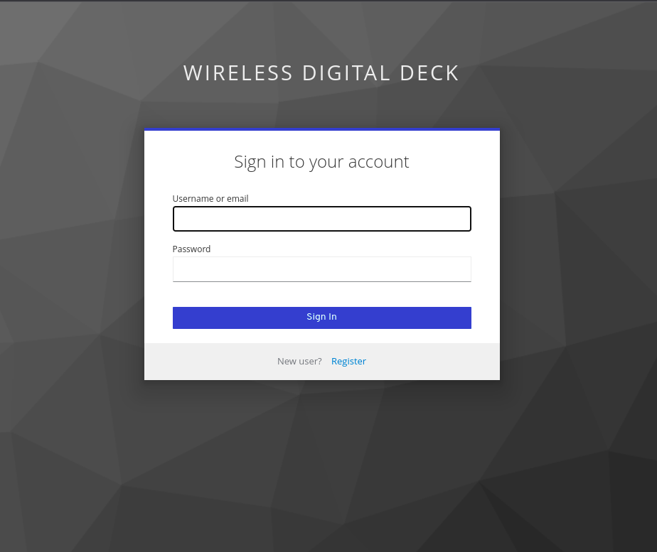
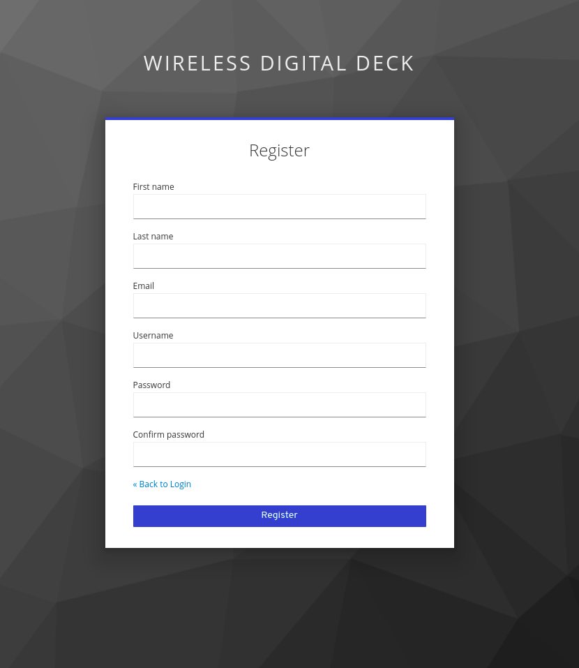
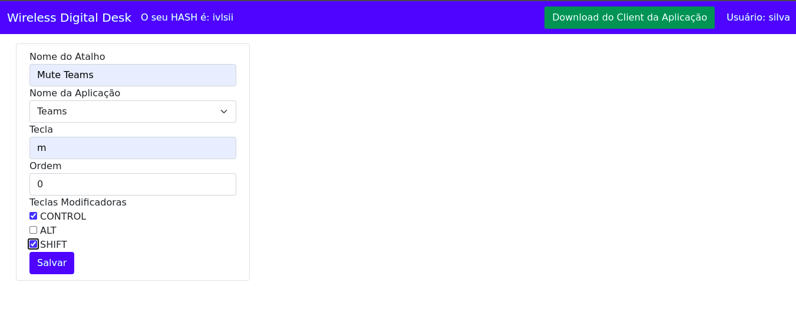
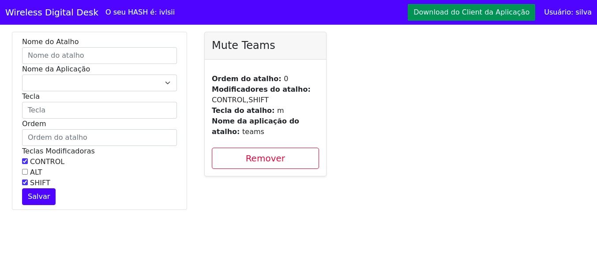
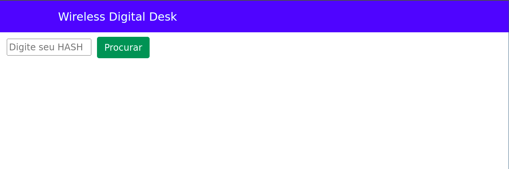
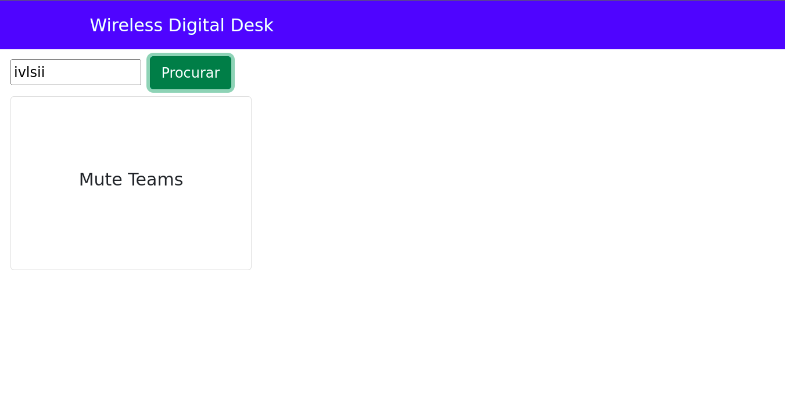

# Wireless Digital Deck

Produto criado como parte da conclusão do curso de Especialização em Arquitetura de Sistemas Distribuidos

### Integrantes:
> Guilherme Pavarina de Sá - 1333514<br/>
> Luan Neves da Silva - 1333386

## Atenção
----
Este documento destina-se ao uso do produto implantado. Caso tenha a necessidade de implantar o produto por si só, as informações de instalação podem ser encontradas em [manual de instalação.](docs/requirements.md)<br />
<br />

## O que é o Wireless Digital Deck?
Inspirados na ferramenta da ELGATO chamada stream deck, foi criado um produto capaz de controlar as ferramentas de comunicação utilizadas para o trabalho remoto, assim como a stream deck consegue controlar qualquer outro tipo de ferramenta. <br/>
Um de seus diferenciais é que a tela do aplicativo não precisa necessariamente estar em foco para o controle de recursos seja realizado.

## Como utilizar?
----
Os passos para utilização da plataforma são os seguintes: <br />
1. Realizar o primeiro acesso no painel de administração do sistema;
2. Criar uma conta para uso próprio ou colaborativo;
3. Cadastrar os atalhos desejados;
4. Realizar o download do client e executar na máquina desejada.
<br />

### **1. Realizando o primeiro acesso**
Clicando [neste link,](http://168.119.240.184:8000/admin) é possível verificar a primeira página da plataforma, onde é possível realizar o cadastro:<br />
<br />
### **2. Cadastrando uma conta na plataforma**
A tela de registro necessita de informações básicas para finalização:<br />
<br />
### **3. Cadastrando atalhos desejados**
Após o cadastro, a tela de criação de atalhos é exibida. A criação é bem intuitiva, bastante preencher corretamente os campos. <br />
A imagem abaixo ilustra a criação de um atalho que controle o microfone na aplicação Microsoft Teams:<br />
<br />
Após salvar seu atalho, a aplicação mostrará ao lado os talhos já criados:<br />
<br />
É importante notar que existe um código HASH que a plataforma disponibiliza. Este é o código único que deve ser utilizado para login através da máquina do usuário, no momento do uso da aplicação. No caso do usuário exemplo, seu código é 
```shell
$ ivlsii
```
### **4. Realizar o download e executar**
O download pode ser realizado através da página principal, após o login.
É importante ter instalado na máquina uma versão acima da 12 do Nodejs. Isso se faz necessário pois será aberta uma conexão http em rede local para acesso através de qualquer dispositivo que esteja conectado na mesma rede.<br />
PAra isso, basta executar os seguintes comandos no diretório onde os arquivos foram extraídos:<br />
```shell
$ npm i
$ npm start
```
Após a execução dos comandos, a POC será inicializada. Basta acessar via rede local a porta 8080 da máquina onde a aplicação foi executada. a seguinte tela será exibida:<br />
<br />
Neste momento, basta digitar o hash obtido pela plataforma, e os atalhos serão carregados automaticamente:<br/>
<br />
Neste momento, basta acionar o botão e o comando referente ao atalho criado será executado.
